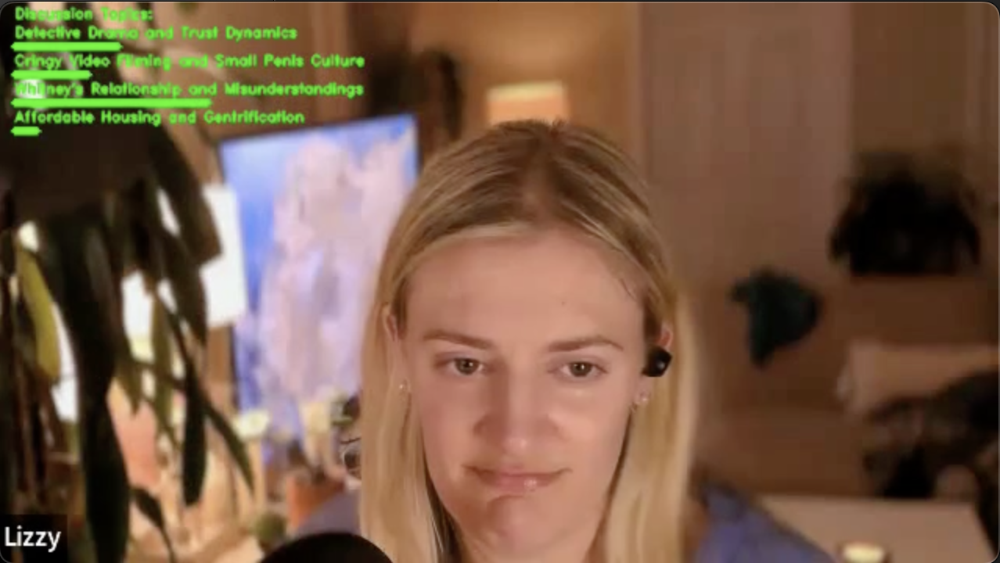

# clipGen

## Introduction
This project focuses on extracting meaningful information from long-form videos through a comprehensive data processing pipeline. It begins by transcribing the video content using OpenAI's speech recognition model, Whisper, followed by performing topic modeling with the BERTopic framework.

Once topics are identified, they are labeled using the OpenAI Chat Completion API, ensuring human-readable labels. The project further analyzes these topics, extracting closely related segments of the transcript using scikit-learn, and then creating corresponding shorter video clips or trailers. Dynamic topic information is then visualized onto each frame using OpenCV.

This project showcases a blend of skills in data engineering, prompt engineering, and data science. The modular design of the codebase allows for flexibility in application, with potential for adaptation to other NLP tasks like classification, summarization, and question answering.

## Key Features
- **Transcription of Videos**: Utilizing Whisper, OpenAI's speech recognition model for accurate video transcriptions.
- **Advanced Topic Modeling**: Employing BERTopic with various, configurable input models for nuanced topic extraction.
- **Human-Readable Labeling**: Enhancing topic labels with OpenAI's Chat Completion API for clarity.
- **Video Clip Generation**: Creating topical video clips based on transcript analysis.
- **Dynamic Topic Visualization**: Displaying topic information with frame-by-frame cosine similarity scores.

## Technologies and Libraries Used
- OpenAI API
- BERTopic
- Transformers
- UMAP
- HDBSCAN
- scikit-learn
- OpenCV
- nltk
- pydub

## Installation and Running Instructions
- Create a virtual environment and install requirements.txt
- Add a video to the video-files directory
- Update the configurations in config.conf
- Run main.py
Note: This code requires `ffmpeg` to be installed. Recommended installation is with `brew install ffmpeg`

## Usage Examples
The image below is a screenshot from an output video generated by this script. In the image you will find the labeled topics and dynamic green bars, which correspond to the cosine similarity of the topic in the frame.

